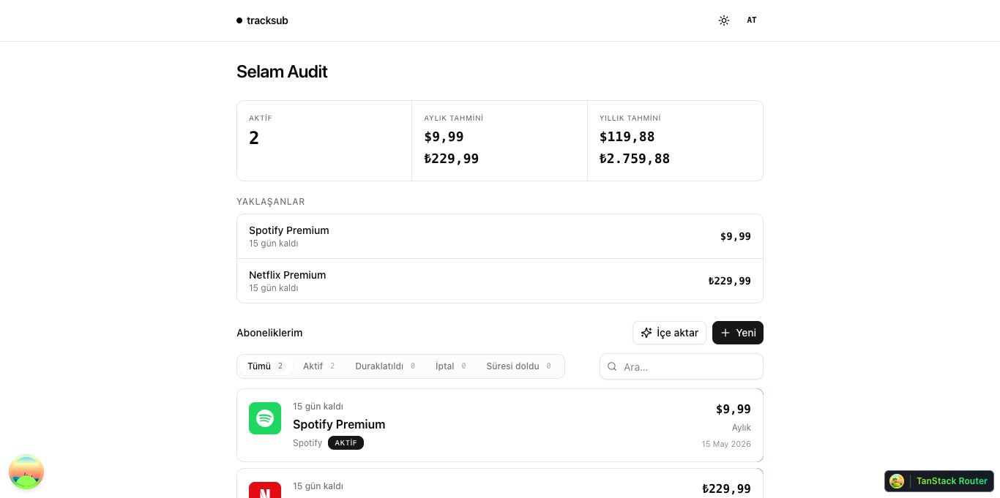

# tracksub

Abonelik takibi. AI mailden ekle. Kendi Gmail'inden hatırlat.



## Ne yapar

- **CRUD**: ad, tutar, periyot (gün/hafta/ay/3ay/yıl/tek/özel), durum. `nextBillingAt` otomatik.
- **Paste-parse**: mail yapıştır → `fal-ai/any-llm` → aday JSON → çoklu seç → ekle.
- **Gmail OAuth**: `gmail.readonly` mail çek + AI'a sok. `gmail.send` kendine reminder. SMTP yok.
- **Reminder cron**: 09:00 Europe/Istanbul. 7/3/1/0 gün kala mail. Idempotent (`unique(subId,offset,day)`).
- **Dashboard**: aktif sayı, aylık/yıllık toplam, yaklaşan 3.

## Stack

API: Fastify 5 + Drizzle + Postgres + better-auth.
Web: React 19 + Rspack + TanStack (Router/Query/Form) + Tailwind v4 + shadcn.
Mobile: Expo SDK 55 + expo-router + NativeWind v4 + reusables.
AI: `@fal-ai/client`. Cron: `node-cron`. Tooling: pnpm + tsgo + oxlint + oxfmt.

## Yapı

```
packages/  shared schemas api-client query
apps/api   Fastify + better-auth + drizzle
apps/web   React + Rspack + TanStack
apps/mobile Expo + expo-router
```

## Başla

```bash
pnpm install
cp .env.example .env
# DATABASE_URL, BETTER_AUTH_SECRET (openssl rand -base64 32)
# FAL_KEY, AI_MODEL=google/gemini-2.5-flash
# GOOGLE_CLIENT_ID/SECRET (opsiyonel — Gmail için)
# redirect: http://localhost:4000/api/auth/callback/google

docker run -d --name tracksub-pg \
  -e POSTGRES_PASSWORD=postgres -e POSTGRES_USER=postgres \
  -e POSTGRES_DB=tracksub -p 5432:5432 postgres:16

pnpm auth:generate && pnpm db:generate && pnpm db:migrate
pnpm dev
# api :4000  web :3000
```

## Komutlar

| | |
|-|-|
| `pnpm dev` | hepsi paralel |
| `pnpm build` | packages → apps |
| `pnpm typecheck` | tsgo |
| `pnpm lint` / `format` | oxlint / oxfmt |
| `pnpm check` | format:check + lint + typecheck |
| `pnpm db:generate/migrate/studio` | drizzle |
| `pnpm auth:generate` | better-auth schema |

## Mobile

```bash
pnpm --filter @tracksub/mobile dev      # Expo
pnpm --filter @tracksub/mobile ios      # Sim
pnpm --filter @tracksub/mobile android  # Emu
```

API URL çözümü: `EXPO_PUBLIC_API_URL` → Expo LAN IP → sim default (`localhost:4000` / `10.0.2.2:4000`).

Auth: `@better-auth/expo` + `expo-secure-store`. Cookie elle eklenir. API'de `expo()` plugin + `trustedOrigins` (`tracksub://`, dev `exp://**`).

## Akışlar

**Manuel**: Dashboard → Yeni → form.
**Paste**: İçe aktar → mail yapıştır → Analiz et → seç → ekle.
**Gmail sync**: Gmail bağla → son N gün (default 90) → AI candidate UI → onay. Token expire → otomatik refresh.
**Reminder**: cron her gün 09:00 → `daysUntil ∈ {7,3,1,0}` → kullanıcının kendi Gmail'inden kendine mail (RFC 822 base64url, `users.messages.send`).

Dev test:
```bash
curl -b cookie.txt -X POST localhost:4000/api/reminders/test
curl -b cookie.txt -X POST localhost:4000/api/reminders/send \
  -H 'Content-Type: application/json' \
  -d '{"subscriptionId":"<uuid>","daysLeft":3}'
```

## Kararlar

- TanStack Router context: `{ auth, queryClient }`. Session src-of-truth = `useQuery(['session'])`.
- Fastify: `plugins/` encapsulation **off** (fastify-plugin), `modules/` **on** (`/api` prefix, autoload).
- Form: `<Field>` wrapper + shadcn `<Input>/<Label>` + TanStack Form render-prop.
- Path alias `@/*` → `apps/web/src/*`.
- Dark mode: CSS vars, `class` strategy, FOUC-engelleyen blocking script `index.html`'de.
- `routeTree.gen.ts` rspack plugin üretir, oxfmt'tan hariç.

## Auth

```
POST /api/auth/sign-up/email   { name, email, password }
POST /api/auth/sign-in/email   { email, password }
POST /api/auth/sign-out
GET  /api/auth/get-session
GET  /api/me                    // korumalı örnek
```

```ts
import { useSession, signIn, signUp, signOut } from '@/lib/auth-client';
const { data: session } = useSession();
await signIn.email({ email, password });
```

## Shadcn ekle

```bash
cd apps/web
pnpm dlx shadcn@latest add dialog dropdown-menu separator
```
